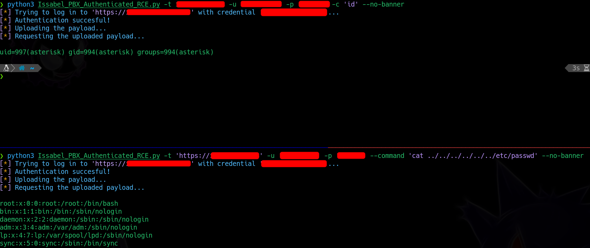

# Issabel PBX 4.0.0 Remote Code Execution (Authenticated) - CVE-2024-0986

## Description/Summary

Issabel PBX 4.0.0 allows a logged in user to use `asterisk_cli` console to create files with `xmldoc` and `dump` commands. 
This allows to execute remote commands based on the name of the uploaded files abusing `restore.php` file.


This PoC script is based on [this PoC Video](https://drive.google.com/file/d/10BYLQ7Rk4oag96afLZouSvDDPvsO7SoJ/view?usp=drive_link).


## Usage

```shell-session
$ python3 Issabel_PBX_Authenticated_RCE.py -u <user> -p <password> -t <ip-address> -c <UNIX command>
```

For example:
```shell-session
$ python3 Issabel_PBX_Authenticated_RCE.py -u 'johncena' -p 'ucantseem3' -t 'https://10.10.10.10' -c 'id'
```



## Notes

- This will create a file located at `/var/www/backup` called `x|<command>`. It is suggested to remove all those files after testing.
- Commands that are too long might not be executed.

## More info
This script was tested on `Issabel PBX 4.0.0`.

More CVE-2024-0986 info:
- [https://nvd.nist.gov/vuln/detail/CVE-2024-0986](https://nvd.nist.gov/vuln/detail/CVE-2024-0986)
- [https://github.com/advisories/GHSA-v9pc-9fc9-4ff8](https://github.com/advisories/GHSA-v9pc-9fc9-4ff8)
- [https://www.opencve.io/cve/CVE-2024-0986](https://www.opencve.io/cve/CVE-2024-0986)


## Disclaimer
The owner of this repository is not responsible for the usage of this software. It was made for educational purposes only.

## Licence
- MIT
